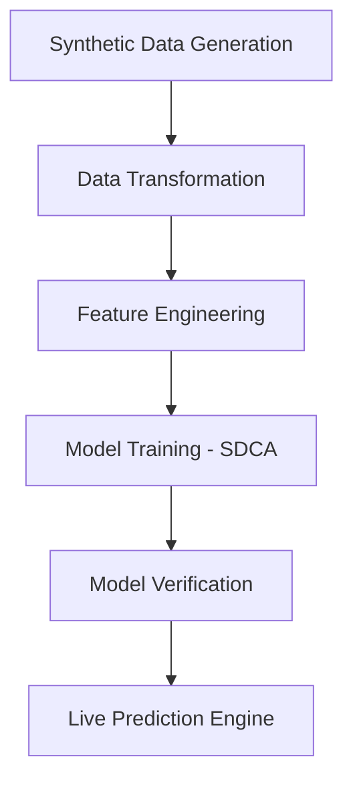

<p align="center">
  
</p>

# 🎓 Smart Student Result Predictor

<p align="center">
  
  
  
  
</p>

<p align="center">
  
  
  
</p>

---

### 🚀 Overview
**Smart Student Result Predictor** is an advanced desktop application that integrates **Machine Learning** with a sleek **Windows Forms** interface to predict student academic outcomes. By analyzing marks and historical trends, the system provides real-time "Pass/Fail" predictions with high confidence scores.

### 🌟 Key Highlights
*   **🧠 Intelligent Core**: Built using `ML.NET` Binary Classification.
*   **🎨 Premium UI**: Dark-themed interactive dashboard with curated HSL colors.
*   **📦 Container Ready**: Standardized Docker environment for consistent deployment.
*   **🏗️ OOP Perfection**: Deep implementation of Inheritance, Encapsulation, and Polymorphism.

---

## 🛠️ Technical Stack
*   **Language:** C# 12
*   **Framework:** .NET 8.0 (WinForms)
*   **AI/ML:** ML.NET (SdcaLogisticRegression)
*   **DevOps:** Docker

---

## 🧠 Machine Learning Workflow
The application follows a standardized ML pipeline to ensure accurate predictions:



---

## 📂 Project Architecture
The project is designed with modularity and clean code principles in mind:

| Component | Responsibility |
| :--- | :--- |
| **MLEngine** | Handles model training, data loading, and prediction logic. |
| **StudentData** | Defines the schema for ML input and output results. |
| **Person/Student** | Domain models implementing business logic and OOPS. |
| **Forms** | UI layer for user interaction and data visualization. |

---

## 🚀 Installation & Usage

### 1. Prerequisites
Ensure you have the [.NET 8.0 SDK](https://dotnet.microsoft.com/download/dotnet/8.0) installed.

### 2. Setup
```bash
# Clone the repository
git clone https://github.com/Abubakar477/Smart-Student-Result-Predictor.git

# Navigate to project
cd "Smart-Student-Result-Predictor"

# Build and Run
dotnet run
```

---

## 🤝 Contributing
Contributions are what make the open-source community such an amazing place!
1. Fork the Project
2. Create your Feature Branch (`git checkout -b feature/AmazingFeature`)
3. Commit your Changes (`git commit -m 'Add some AmazingFeature'`)
4. Push to the Branch (`git push origin feature/AmazingFeature`)
5. Open a Pull Request

---

## 📄 License
Distributed under the **MIT License**. See `LICENSE` for more information.

## 📫 Contact
**Abubakar** - *Project Maintainer*
*   **LinkedIn**: [Your Profile Name](https://linkedin.com/in/)
*   **Portfolio**: [Your Portfolio URL](https://github.com/Abubakar477)
*   **GitHub**: [@Abubakar477](https://github.com/Abubakar477)

---
<p align="center">
  <i>Developed with ❤️ using Power of .NET & ML</i>
</p>
